```{r setup, include=FALSE}
knitr::opts_chunk$set(echo = TRUE)
```

# Application User Guide Link

The application is avariable [here](https://liyuhong0110.shinyapps.io/Project_Application/).

# 1. Interface design
 The interface mainly about three parts.
 
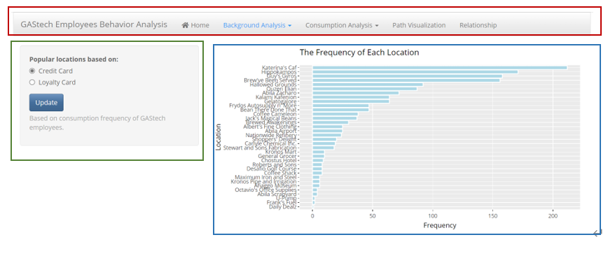

## 1.1 For Navigation Bar (red box)
The top navigation bar has 5 main sections with drop-down selections:  

i.  Home  
ii. Background Analysis  

* Popular Locations  
* Hot points of News Articles  

iii. Consumption Analysis 
    
* Consumption of each Location
* Consumption Locations of Credit Card 

iv. Path Visualization
v. Relationship

## 1.2 For Side Panel (green box)
The side panel provides users with variable toggling parameters that can filter the main panel. Users can determine the visualization format of the main panel according to the parameters.

## 1.3 For Main Panel (blue box)
The main panel is where the visualization will be shown.

# 2. Introduction to main pages 
## 2.1 Home
The home page is a welcoming page, mainly introduces the general situation of GASTech company, the background of the story, the information about datasets we are using and the purpose of this application.

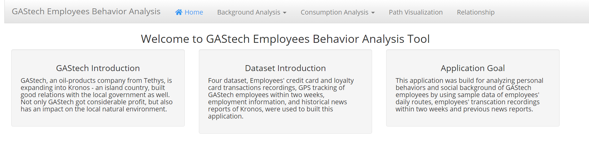
 
## 2.2 Background Analysis
The background analysis mainly includes two parts: one is to find the most popular location among GASTech employees by screening different payment methods; One is to find the most frequently occurring words in news articles in the past two decades.

### 2.2.1 Popular Locations

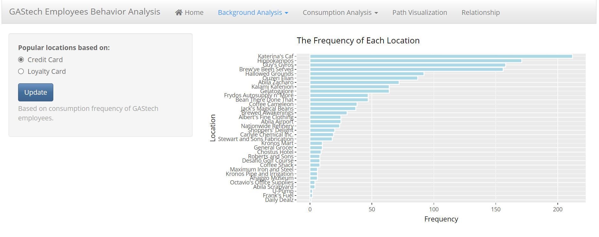
  
The popular locations provide an overall view of how often each location is consumed by GASTech employees within two weeks. Users can choose different payment methods - credit card, consumption and loyalty card consumption to distinguish the occurrence times of different locations.

And also, this graph is interactive since users can see detailed numbers of each location's frequency.

### 2.2.2 Hot points of News Articles

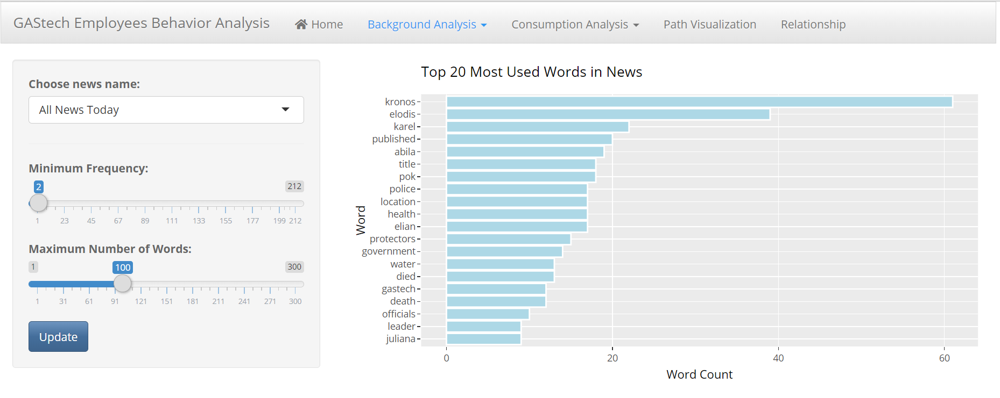
 
This interface uses two kinds of visualizing methods - bar chart and word cloud, mainly displays the news information in recent 20 years. By selecting the news of different newspapers, you can find out which words appear most frequently.

The first control panel is used for users to filter different newspapers. The second control panel can change the minimum standard of word frequency in bar chart. The third panel can control the maximum number of words in word cloud.
 
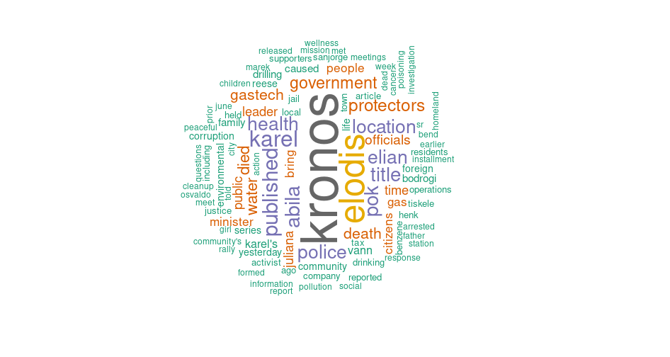
 
## 2.3 Consumption Analysis
Consumption analysis mainly adds the change of time to find the most popular places for GASTech employees on different dates and time periods.

### 2.3.1 Consumption of each Location
 
Users can select different locations to observe which is consumed the most times on different dates and time periods by the heatmap, the darker the red, the higher the heat of the site among employees, so as to obtain the insights of consumption preferences of GASTech employees.

And also, the line chart can show the trend changes of purchase value by all employees during two weeks varies of locations.

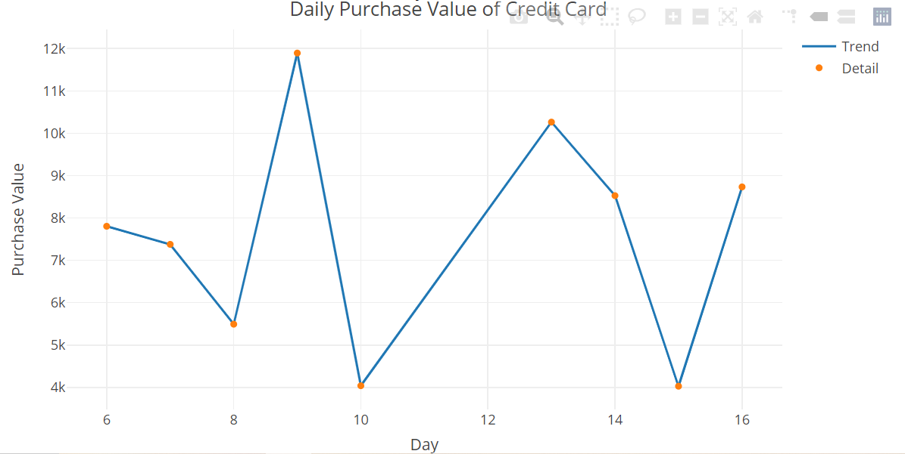

### 2.3.2 Consumption Locations of Credit Card

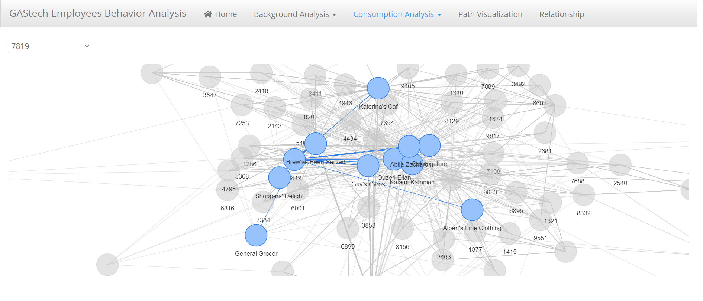
 
The above chart is a relationship chart. Users can select the unique four digits number of GASTech employees’ credit card on the left control panel. After zooming in on the right, users can see the locations of where the credit card has been consumed.

## 2.4 Path Visualization

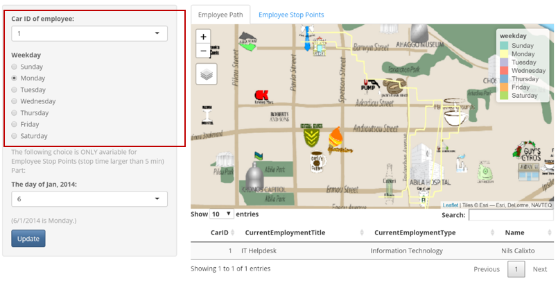
 
After manipulating GPS data, it can be used to visualize the walking path of each employee in weekdays, and obtain the employee's personal information through unique car ids and present it on the data table.

Each car ID represents an employee. Users can select different car IDs to filter the employee paths they want to observe. In the second control panel, you can select different days of the week, and the path of employees in the main panel will change accordingly, so as to find suspicious behaviors of employees. 

And also, can change the contents in the data table by selecting different car IDs. The data table will tell the user the employee's detailed information, about names, department and position corresponding to this car ID.

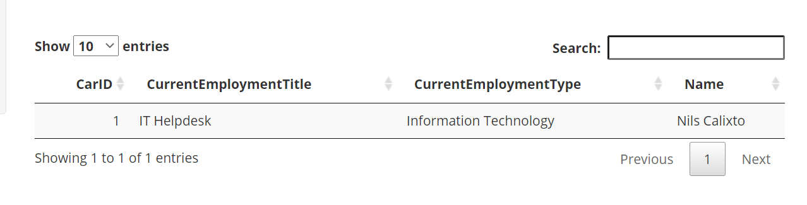

The third control button is the date, which is used to show where employees stay for more than five minutes， and named as stop points. Each point has a great possibility showing that employees have spent in this place.

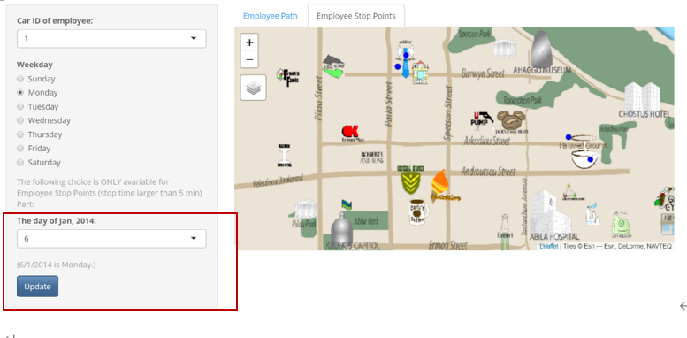

## 2.5 Relationship

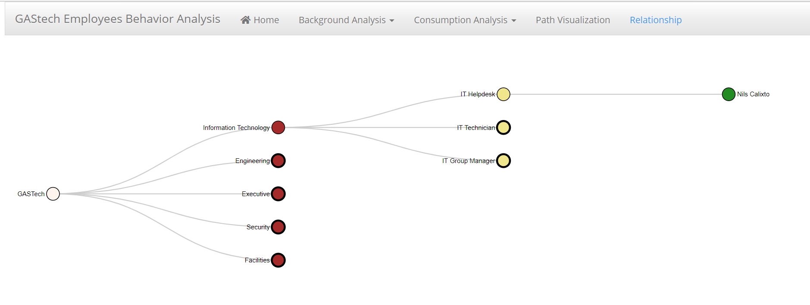
 
This interface shows the department structure of GASTech company, which department and position each employee belongs to. Users can click "dot", red indicates the department of GASTech company, yellow dot at the next level indicates the positions included in this department, and the last level is the detailed information - employee’s name.


