```{r setup, include=FALSE}
knitr::opts_chunk$set(echo = TRUE)
```

# Abstract
Interactive applications developed using Shiny for the R language can satisfy move disciplines interested in movement which are visualization and visual analytics (Ware C. 2013). Shiny allows customizing the user interface of the application, providing an elegant environment for displaying user input controls and analog output-the latter is updated at the same time as the input changes. The flexible nature of R language makes it possible to freely choose and observe the movement trajectories of different objects, thus promoting the combination of Shiny and R in model visualization.

# 1. Introduction

Movement data in space and time provide critical information about the behaviour of objects studied, i.e., vehicles, humans, and animals. Insights from spatial and temporal movements drive many human and ecological studies. These studies enable in-depth analysis and understanding of complex processes like an animal and human migration, forest fires and natural disasters as well as mobility and transportation. 

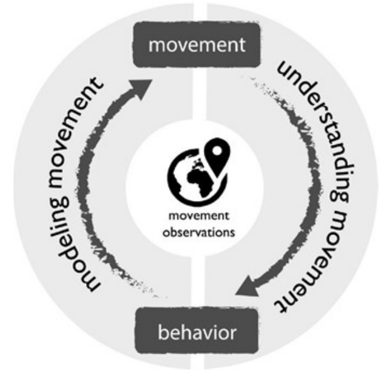{width=50%,length=25%}

For most people, it is really hard to explore geospatial data without using a map. With this application, we demonstrate how to create a free and open-source solution using R and R Shiny, that allows users to interact with the geospatial data, and quickly find what they want to see using the interactive Shiny app.

# 2. Motivation of the Application

Recently, a number of studies in computer science focused on identification of human movement behaviour patterns from GPS trajectories. These studies look at identification of significant places (i.e., locations which play an important role in the activities of a user) (Ye et al., 2009), classification of human behaviour in these places (Huang et al., 2013) and analysis of spatial interactions between significant places identified from trajectories (Sila-Nowicka et al, 2014). In addition to this, new tracking technologies for observation of human movement have been deployed as alternatives to GPS technology. 

A common design approach for visual analytics systems for highly-dimensional complex data is to use linked views, that is a set of interactively connected visualisations, each of which provides a different perspective on the data (Roberts, 2007). This methodology takes a set of data displays (each showing a selection of the given dimensions in some particular way) and then allows the interaction in one view (e.g., selection, zoom in, zoom out, etc.) to simultaneously modify displays in all views. This is relevant to visual exploration of spatio-temporal data, since it enables generating a unique spatial, temporal or spatio-temporal perspective on a pattern appearing in a linked attribute-only view (Andrienko, 2010).

Trajectory data, defined here as a discrete time series of measured locations, are collected at detailed temporal resolutions and on particular temporal schedules. Global Positioning System (GPS) devices are now in everything from watches to cars and, of course, smartphones. This means that GPS datasets have the ability to track a large proportion of the world’s population. Depending on sampling frequency and schedules, such data volume can be very large (long, densely sampled trajectories).

Additional complexity is introduced with simultaneous collection of related information either directly from other sensors or derived from environmental data (Cagnacci et al., 2010). Although there are privacy concerns, when appropriately anonymized and aggregated, GPS datasets have the potential to help tackle the issues raised in human movement events.  

# 3. Review and Critic on Past Works

Identifying a representative route from a set of trajectories is a common topic in GIScience and there are many approaches outside move. Brudson (2007) uses principal curves to identify the most probable route from a set of GPS pedestrian trajectories. Similar methods are widely used in navigation and even developed for reconstruction of representative 3-D trajectories: reconstruct 3-D bicycle tracks from GPS trajectories – a method that could be of interest for movement of animals freely moving in 3-D (birds, sea mammals). 

In move, Etienne et al. developed a method to identify the main naval route from a set of vessel trajectories, sampled at equal times. Pelekis et al. take an alternative approach and consider the uncertainty in trajectory measurements by constructing a fuzzy vector representation of each trajectory. They use this representation to construct a so-called centroid trajectory as the representative path based on density of trajectory points at each moment in time.

Many move studies mentioned to employ the linked views paradigm. Others include not only spatio-temporal displays, but also attribute visualisations. Tominski et al. (2012) introduce a trajectory wall. Here, car trajectories are represented as the 2-D plane of the geographic space. Ribbons are stacked over their geographic path and their segments coloured according to an attribute (speed). This view is interactively linked to a time lens, where clusters of temporally similar trajectories are shown using edge-bundling. 

The system allows identification of temporal patterns in car movement and in particular anomalies in regular flow, such as traffic jams. Andrienko et al. present linked views for a comprehensive visual exploration of any type of movement trajectories. These systems include a number of attribute visualisations, density maps, temporal visualisations and a number of other displays that allow incorporation of contextual information.

# 4. Design Framework

Our application used the free and open-source R language which offers a thriving programming environment for statistical and graphical analysis. We load all the required libraries to the app. The application interface is usually created using fluidPage which ensures that the page is laid out dynamically. Our considerations for creation are listed following:

* Explanatory Data Analysis for Background.

* Using standard R packages on the CRAN for supportability.

* Employing Shiny App to webify the codes for simplicity.

* Offering options and visualizations for interactivity.

## 4.1. Data Preparation

The dataset used in this project was same as the Vast Challenge 2021 Mini Challenge 1 and 2. The dataset provided by GASTech company involves employees' transaction records and car GPS records and employees' job information. And there was also a file included previous news articles for social background analysis.

First step for data preparation was to conduct in R using base R and the dplyr package to narrow the scope of the data by removing unused data and joining data into correct format. Some variables were grouped logically in the base of common definitions. The further preparation was made according to the real requirements of the different analysis methods applied.

## 4.2. Background Analysis

Our application allows interactive bivariate frequency analysis to be performed under the Background Analysis tab. 

In Figure 2, the bar chart shows the number of transactions made by employees of the GASTech company in different locations to reflect the popularity of different consumption locations. This bar chart also allows users to select the type of card to view the transaction status of different types of cards in different locations.

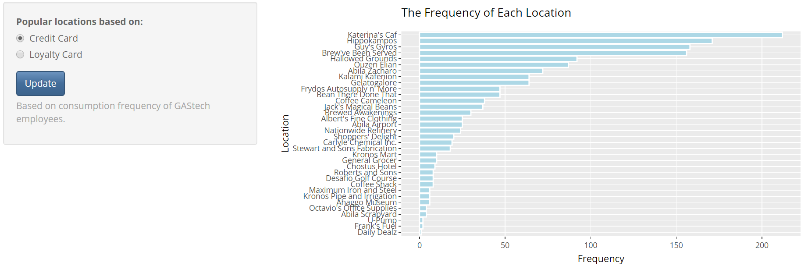

It is noted that Katerina’s Caf has the largest traffic volume of both credit cards and loyalty cards. About one-third of the locations have more than 50 transactions over the investigated 2 weeks.

## 4.3. Hotpoints of News Articles

The Hotpoints of News Articles sector gives the interactive visualization to view the top n most used words within each news group. The word cloud diagram can visually display the words that appear more frequently in different news. The user can select the news name he is interested in through the drop-down box on the left side of Figure 3 to observe. At the same time, our application also adds Minimum Frequency and Maximum Number of Words these two horizontal setting boxes. For example, the most frequent words in News Desk include Kronos, government, gastech, etc.
 	 


There is also a bar chart that helps to highlight the top 20 most frequently occurring words in selected news. If the user selects a different news group, word cloud and bar chart will change accordingly at the same time. The words with high frequency tended to be related to social hot points, and they can help user to understand the local social background intuitively and quickly.

## 4.4. Consumption Analysis

There are two parts in consumption analysis and we only used the transaction records of credit card in this part due to repeated records in both credit card and loyalty card dataset. The first part is to analyze daily transaction frequency and value in each locations, user can also observe the change of total transaction value in below line chart (Figure4 and Figure 5).
 
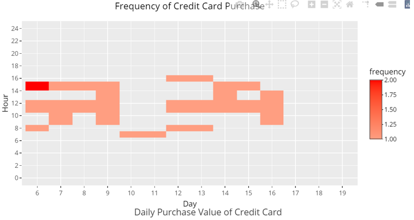

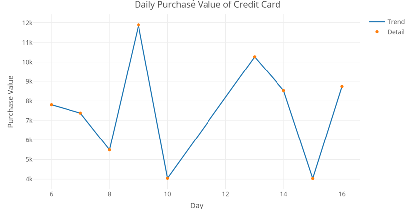

The second part of analysis is to observe the relationship between credit cards and locations (Figure 6). In this part, we can not only know transaction locations of each card but also know the credit cards that happened transaction in each locations by selecting credit card number of locations in the options box in the upper left corner.

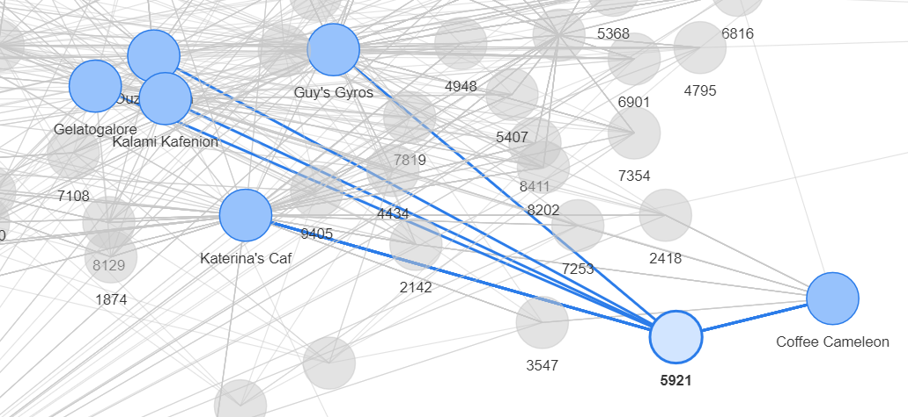

## 4.5. Path Analysis

The GPS trajectories of the geographic information associated with the GASTech data is defined as locations as shown in Figure 7. 
 
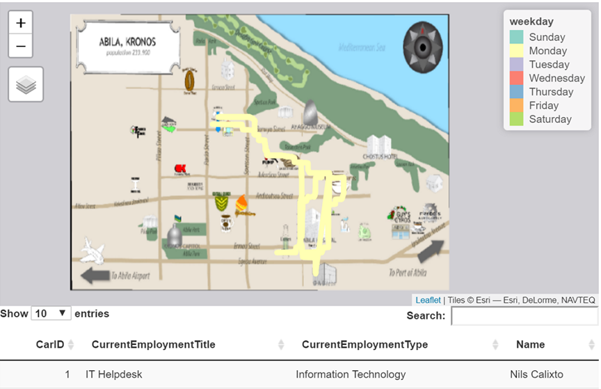 

Users can explore the GASTech employee’s movement data between any origin and destination location their daily moving. This tool also offers an intuitive way to select the day of the week (Figure 8) directly from the list where users simultaneously get the information of location, time, and intermediate stops. Users can choose what data they want to see by selecting Car ID of employee from the drop-down list pane. They can zoom in and out or pan the map to find the location and employee’s movement of interest. This panel also provides a data table of the selected car user, and we can know current employment title, current employment type and name of this car user.

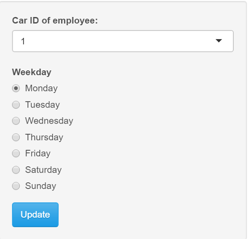

## 4.6. Relationship Analysis

In the part of relationship analysis, we provided organization structure of GAStech company through tree diagram. Employees' employment positions are clearly displayed in the diagram, and users can easily know which employees are in the same employment types or have the same employment titles. It can help users to speculate whether there is a close relationship or connection between employees (Figure 9).

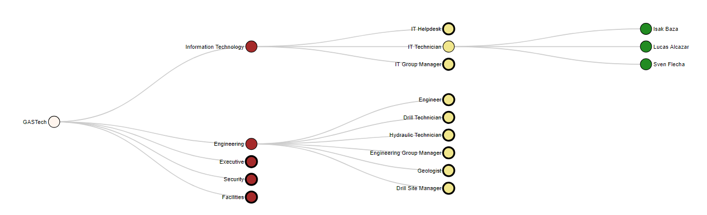

# 5. Demostration
The final interactive plots in the Shiny application can help to identify a wide range of insights.

In addition to the popular locations mentioned above, the tool can also be used to find the popular time and day for each location. For example, so we can know that Albert's Fine Clothing is more popular in the evening because the transaction time is more concentrated in the evening (Figure 10). 

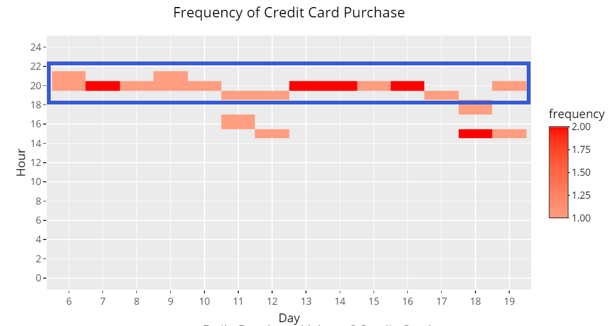

Furthermore, using employees’ transaction data, and also their GPS record, we can identify anomalies or even criminal acts of employees, which it is helpful for police to maintain public order or investigate crimes. For example, the transaction amount of Albert's Fine Clothing on 17/1/2014 is much higher than that on other days, so we can guess that this day may be a sales promotion day or there is credit card theft on that day (Figure 11).

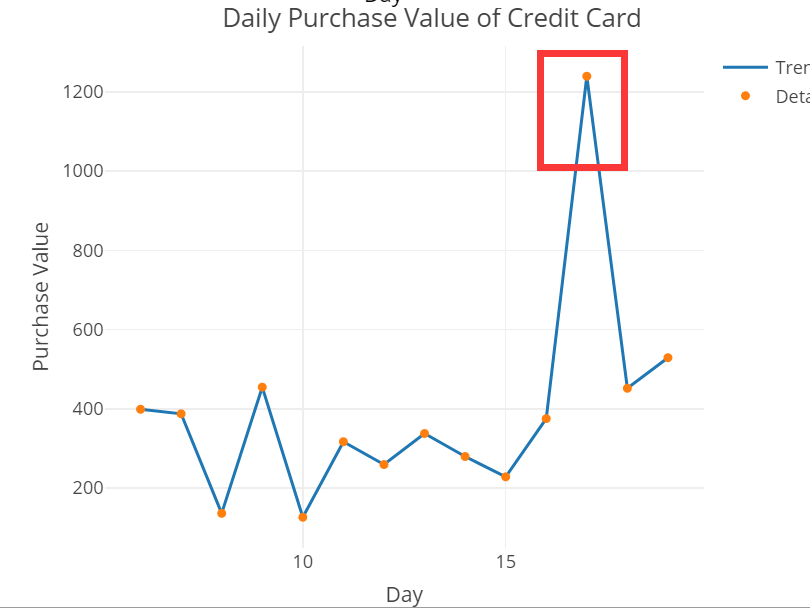

Based on the tree diagram, the official relationship within employees in GASTech can be got. For example, there were five employees (one is IT helpdesk, three are IT Technician and the remaining one is IT Group Manager) whose work type was relative to Information Technology. Hence, they were likely to be colleagues, and IT Group Manager, Linnea Bergen, was the leader of other four employees (Figure 12).

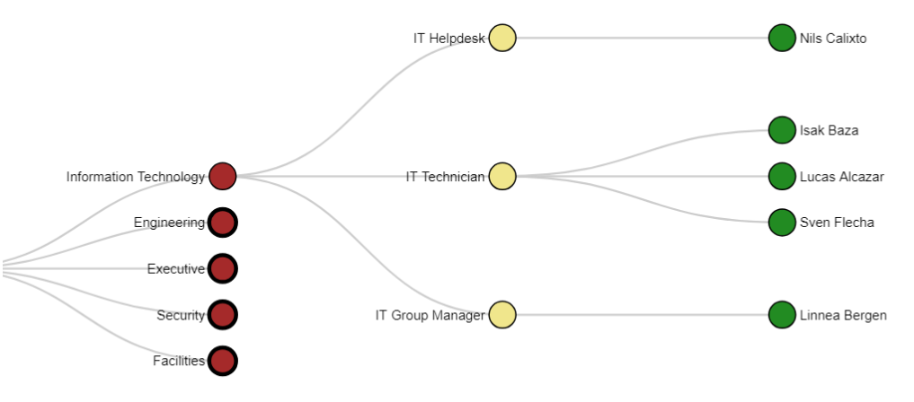

This study also has reference value when we expand or change the data set. Therefore, this Shiny application can be used on a larger and more extensive scale, for the analysis of individual behavior and regional social environment.  

# 6. Discussion

Our interactive application allows users to observe the personal consumption records of the employees of the GASTech company. Through analysis, the five most popular consumption locations for GASTech employees are Katerina's Caf, Hippokampos, Guy's Gyros, Brew've Been Served, and Ouzeri Elian. At the same time, the high-frequency words appearing in these news articles can be considered as news hotpoints. The App shows that the most frequent words are Kronos, gastech, abila, government, pok title, arrest, etc. The appearance of these high-frequency words helps users sort out the context of news events to a certain extent.

In terms of social relationship background, our application tries to help users observe the consumption time, consumption location, car id number and other information of the employees users are interested in, so that they will be able to establish the temporal and spatial movement relationship network for each employee. In addition, regarding the relationship network, our application also allows readers to obtain the company background of the employee's work, such as company name, work department, title, contacts, etc.

# 7. Future Work

Our analysis of the temporal sequences of network motifs in individual movement networks revealed successions of spatial patterns corresponding to changes in behavioural modes that can be attributed to specific spatio-temporal events of each employee trajectory. Future applications of our method to multi-layered movement and social network analysis yield considerable promises for extending the study of complex movement patterns at the population level.

The application was developed using Shiny on R, supported with a range of geo-spatial packages to provide users with a suite of techniques to derive insights from the data. Given the emphasis on visual analytics in this project, the various components of the application were developed with due consideration of the taxonomy of interactive visualizations.

We suggest that our further development of the app draw the idea of adding additional user interaction features within each view in the app. The users could be given the option to highlight certain sets of interest in the frequency bar chart which can speed up the interpretation of findings. As another example, the bar chart could incorporate an option to compare the current view with the finding for a different news group (i.e., adding a reference line) to make comparisons easier for users.

Also, future work can also address the two trajectories with a potential encounter computed based on the Brownian bridge movement model to explore their connection or similar trajectories.

# References

[1] Andrienko G, Andrienko N. (2010). A general framework for using aggregation in visual exploration of movement data. The Cartographic Journal. 47(1):22–40.

[2] Brundson C. (2007). Path Estimation from GPS Tracks. Maynooth: Ireland: Proceedings of Geocomputation 2007.

[3] Cagnacci F, Boitani L, Powell RA, Boyce MS. (2010). Animal ecology meets GPS-based radiotelemetry: a perfect storm of opportunities and challenges. Phil Trans Biol Sci. 365:2157–62.

[4] Huang W, Li M, Hu W, Song G, Xing X, Xie K. (2013). Cost sensitive GPS-based activity recognition, vol. 2013. Shenyang, China: Proceedings of the 10th International Conference on Fuzzy Systems and Knowledge Discovery (FSKD), p. 962–6.

[5] Roberts J. (2007). State of the art: Coordinated & multiple views in exploratory visualization. In: Proceedings of the International Conference on Coordinated and Multiple Views in Exploratory Visualization. Zurich, Switzerland. p. 61–71.

[6] Siła-Nowicka K, Oshan T, Vandrol J, Fotheringham S. (2014). The Use of Volunteered Geographic Information for Spatial Interaction Modelling. Vienna, Austria: Proceedings of GIScience. 23-26.

[7] Tominski C, Schumann H, Andrienko G, Andrienko N. (2012). Stacking-Based Visualization of Trajectory Attribute Data. IEEE Trans Vis Comput Graph. 18(12):2565–74.

[8] Umair M, Kim WS, Choi BC, Jung SY. (2014). Discovering personal places from location traces. Bongpyong-myun, Pyeongchang, South Korea: Proceedings of the 16th International Conference on Advanced Communication Technology, p. 709–13.

[9] Ware C. (2013). Information Visualization: Perception for Design. 3rd ed. Elsevier/Morgan: Kaufmann.

[10] Ye Y, Zheng Y, Chen Y. (2009). Mining individual life pattern based on location history. In: Mobile data management: systems, services and middleware. Taipei, Taiwan: IEEE MDM’09, p. 1–10.

